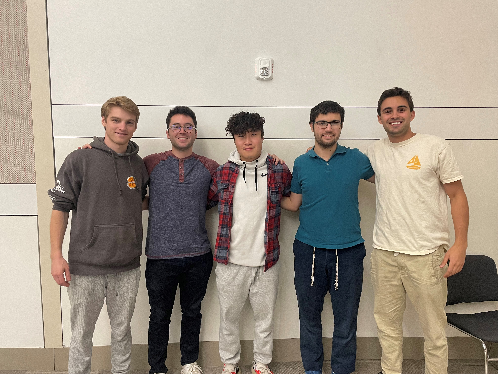

# Codeless App Generator

The Codeless App Generator is a web application that allows users to easily create and download their own React Native web application, without writing any code of course. Users can enter requests for new features using plain English, and the app sends an API call to a customized NLP model based on the Cohere API. The NLP model classifies the user's request and returns the classification, as well as the two next highest confidence possibilities. The app then gathers the necessary files from a Firebase storage cluster based on the requested features, zips them, and allows the user to download the zip file of the generated app. To install and run the app, the user needs to extract the files and run a batch script that will automatically install node, npm, and the necessary node modules for the app. Once this is done, the user can run the app by pressing the `w` key, and the generated app will load in their browser after a few seconds.





## Block Diagram of Component Relationships


## Table of Contents

- [Getting Started](#getting-started)
- [Usage](#usage)
- [Contributing](#contributing)
- [License](#license)

## Getting Started

### Prerequisites

To run the Codeless App Generator, you need to have the following software installed on your machine:

- Node.js
- npm

### Installation

To install the Codeless App Generator, follow these steps:

1. Clone the repository to your local machine:
```
git clone https://github.com/<YOUR-USERNAME>/Codeless-App-Generator.git
```

2. Change to the directory of the cloned repository:
```
cd Codeless-App-Generator
```

3. Install the necessary dependencies:
```
npm install
```

### Configuration

To configure the Codeless App Generator, you need to create a `.env` file in the root directory of the project with the following variables:

- `COHERE_API_KEY`: your Cohere API key
- `COHERE_MODEL_ID`: the ID of your custom NLP model
- `FIREBASE_API_KEY`: your Firebase API key
- `FIREBASE_BUCKET_URL`: the URL of your Firebase storage bucket

You will also need to set these variables in their respective locations in the code, since they currently use our private github secrets

### Starting the App

To start the Codeless App Generator, run the following command in the root directory of the project:
```
npm start
```
This will start the app. Press `w` to open it in your web browser

## Usage

To use the Codeless App Generator, follow these steps:

1. Enter a request for a new feature using plain English.
2. The app will send an API call to the custom NLP model to classify the request.
3. The app will gather the necessary files from the Firebase storage cluster based on the requested features, zip them, and allow the user to download the zip file of the generated app.
4. Extract the files and run the batch script to install node, npm, and the necessary node modules for the app.
5. Run the app by pressing a key, and the generated app will load in your browser after a few seconds.

## Contributing

We welcome contributions from anyone! If you'd like to contribute to the Codeless App Generator, please follow these steps:

1. Fork the repository on GitHub.
2. Clone the forked repository to your local machine.
3. Create a new branch for your changes:
```
git checkout -b <YOUR-BRANCH-NAME>
```
4. Make your changes to the code.


